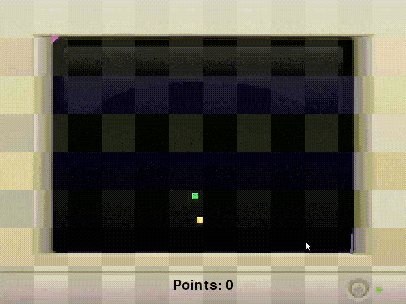

# SnakeFloodFill

**Número da Lista**: 1 
**Conteúdo da Disciplina**: Grafos 1 

## Alunos
|Matrícula | Aluno |
| -- | -- |
| 19/0025379  |  Brenno Oliveira Silva |
| 19/0020377  |  Thiago Sampaio de Paiva |

## Sobre 
O projeto SnakeFloodFill tem como objetivo ser um jogo da cobrinha onde que há varias areas infectadas que cresce com Flood Fill. O jogador tem que obter a melhor pontuação enquanto evita as áreas infectadas.

## Screenshots

## Vídeos

### Apresentação
https://user-images.githubusercontent.com/54643530/152893173-d34ad8ab-16e9-43ae-ab26-84719f52d0ea.mp4

### Exemplo 1
https://user-images.githubusercontent.com/54643530/152890970-dea594d3-ffd3-4604-9a75-7c3177fda20d.mp4

### Exemplo 2
https://user-images.githubusercontent.com/54643530/152890982-96f740ad-2b04-493c-bdec-27202aeaaf27.mp4

## Instalação 
**Linguagem**: Python 
**Pré-requisitos**: Python, Pip e Pygame 

## Uso 
- Clone o repositório 
`git clone https://github.com/projeto-de-algoritmos/Grafos1_SnakeFloodFill`
- Instale as dependências 
`pip install -r requirements.txt` 
- Na raiz do projeto, execute 
`python run_game.py`

## Referências
Em nosso projeto os algoritmos foram baseados nas aulas da disciplina de Projetos de Algoritmose e nos seguintes links:
- [Live de Python #158 - Jogos com Pygame](https://www.youtube.com/watch?v=t5uxBACjp8Y)
- [Refactoring A Tower Defense Game In Python // CODE ROAST](https://www.youtube.com/watch?v=8eWYxNpMjSU)
- [Depth First Search in Python Recursive and Non Recursive Programming](https://www.koderdojo.com/blog/depth-first-search-in-python-recursive-and-non-recursive-programming)
